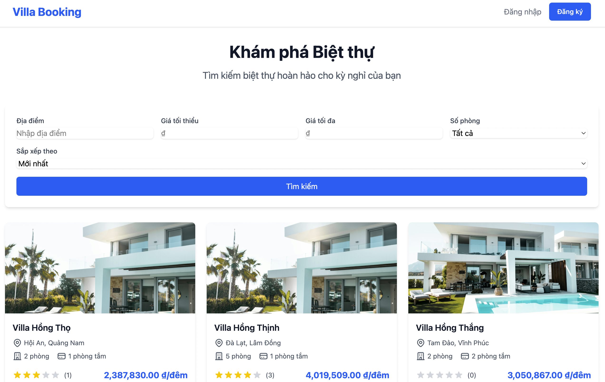
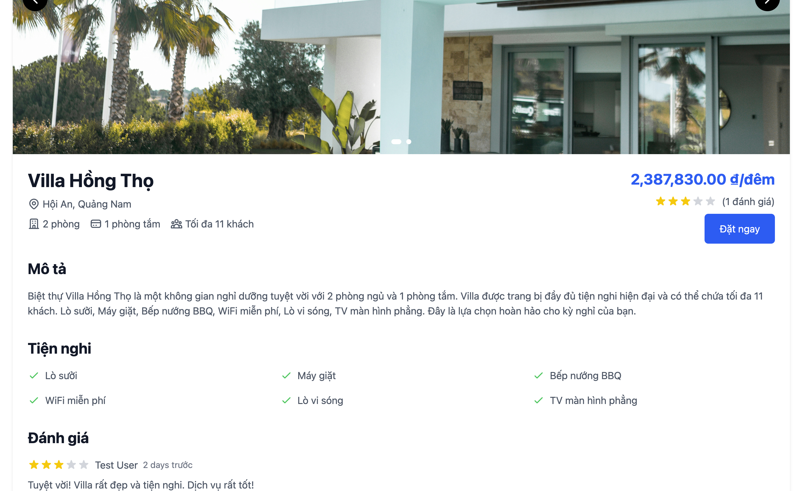

# Villa Booking

Hệ thống đặt phòng villa trực tuyến được xây dựng bằng Ruby on Rails 7 và Tailwind CSS.



---



## Tính năng chính

- 🏠 Quản lý và đặt phòng villa
- 👤 Hệ thống xác thực người dùng (đăng ký, đăng nhập, xác nhận email)
- 🔐 Đăng nhập qua Google OAuth2
- 📅 Quản lý lịch đặt phòng
- 💰 Hiển thị giá và tính toán tổng tiền
- 💳 Thanh toán tiền điện tử (QR code)
- 📱 Giao diện responsive, thân thiện với người dùng

## Yêu cầu hệ thống

- Ruby 3.1.3 hoặc cao hơn
- Rails 7.2.2 hoặc cao hơn
- PostgreSQL
- Node.js 14+ và Yarn
- Redis (cho Sidekiq)

## Cài đặt (Phương pháp 1: Local)

1. Clone repository:
```bash
git clone https://github.com/your-username/villa-booking.git
cd villa-booking
```

2. Cài đặt dependencies:
```bash
bundle install
yarn install
```

3. Thiết lập database:
```bash
rails db:create
rails db:migrate
rails db:seed  # Nếu muốn thêm dữ liệu mẫu
```

4. Cấu hình môi trường:
- Copy file `.env.example` thành `.env`
- Cập nhật các biến môi trường trong `.env`:
  ```
  # Gmail
  GMAIL_USERNAME=your-email@gmail.com
  GMAIL_PASSWORD=your-app-specific-password
  
  # Google OAuth
  GOOGLE_CLIENT_ID=your_client_id
  GOOGLE_CLIENT_SECRET=your_client_secret
  ```

5. Chạy Sidekiq (xử lý queue gửi email):
```bash
bundle exec sidekiq
```

6. Khởi động server:
```bash
bin/dev
```

Truy cập http://localhost:3000 để xem ứng dụng.

## Cài đặt (Phương pháp 2: Docker)

1. Clone repository:
```bash
git clone https://github.com/your-username/villa-booking.git
cd villa-booking
```

2. Cấu hình môi trường (tương tự như trên)

3. Khởi động với Docker Compose:
```bash
docker compose up
```

Truy cập http://localhost:3000 để xem ứng dụng.

## Cấu trúc dự án

```
app/
├── controllers/       # Controllers xử lý logic
├── models/            # Models và quan hệ dữ liệu
├── views/             # Templates và layouts
├── javascript/        # JavaScript và Stimulus controllers
├── assets/            # Assets (CSS, images)
├── mailers/           # Mailer templates
└── components/        # View components
```

## Cấu trúc database

- **Users**: Thông tin người dùng và xác thực
- **Villas**: Thông tin về villa (tên, địa chỉ, giá, mô tả, trạng thái)
- **Amenities**: Các tiện ích của villa
- **VillaAmenities**: Bảng trung gian liên kết villa với tiện ích
- **Bookings**: Thông tin đặt phòng (check-in, check-out, giá, trạng thái)
- **Payments**: Thông tin thanh toán cho booking
- **Reviews**: Đánh giá của người dùng về villa

## Công nghệ sử dụng

- 🛤 Ruby on Rails 7.2
- 💅 Tailwind CSS 4.2
- 🎨 Hotwire (Turbo & Stimulus)
- 📨 Action Mailer + Gmail SMTP
- 🔐 Devise (Authentication)
- 🔒 OmniAuth (Google OAuth2)
- 👷‍♂️ Sidekiq (Background jobs)
- 🗄 PostgreSQL
- 🐳 Docker & Docker Compose

## Cấu hình cần thiết

### Google OAuth

1. Tạo dự án trên Google Cloud Console
2. Cấu hình OAuth consent screen
3. Tạo OAuth client ID (Web application)
4. Thêm Authorized redirect URIs: `http://localhost:3000/users/auth/google_oauth2/callback`
5. Sao chép Client ID và Client Secret vào file `.env`

### Gmail để gửi email

1. Bật xác thực 2 bước trong tài khoản Google
2. Tạo App Password:
   - Vào cài đặt tài khoản Google
   - Tìm "App Passwords"
   - Chọn "Mail" và thiết bị của bạn
   - Sao chép mật khẩu 16 ký tự được tạo
3. Sử dụng email và App Password trong file `.env`

## Phát triển

1. Tạo nhánh mới cho tính năng:
```bash
git checkout -b feature/ten-tinh-nang
```

2. Commit thay đổi:
```bash
git commit -am 'Thêm tính năng mới'
```

3. Push lên nhánh:
```bash
git push origin feature/ten-tinh-nang
```

4. Tạo Pull Request

## Vấn đề thường gặp

1. **Không thể gửi email**: Kiểm tra cấu hình SMTP và App Password
2. **Lỗi đăng nhập Google**: Kiểm tra Client ID và Client Secret, đảm bảo đã thêm đúng redirect URI
3. **Lỗi database**: Kiểm tra kết nối PostgreSQL và chạy các migration

## Hỗ trợ

Nếu bạn gặp vấn đề hoặc có câu hỏi:
- Tạo issue trong repository
- Liên hệ với team phát triển

## License

Dự án này được phân phối dưới [MIT License](LICENSE).
